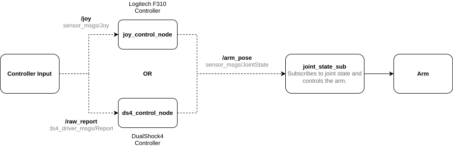

# Arm Joystick Control

## Setup

Clone this repository to the source folder of ROS2 workspace and run the setup script in the `setup/` folder.

```bash
./setup/arm-joystick-control-setup.sh
```

The script works if a `$WORKSPACE` environment variable is set to the desired ROS workspace path.

The setup script sets up to support both the DualShock4 and Logitech F310 controllers.

### Note on running this package in Docker container

Append the following flags in `runArgs` section of `devcontainer.json` when running the container to access the controller.

```json
"runArgs": [

// Other flags ...

"--volume=/dev:/dev:rw",
"--device=/dev/uinput:/dev/uinput",
"--device=/dev/input:/dev/input",
"--device=/dev/hidraw1:/dev/hidraw1",

]
```

Or when running from terminal using `docker run ...`

```bash
--volume=/dev:/dev:rw \
--device=/dev/uinput:/dev/uinput \
--device=/dev/input:/dev/input \
--device=/dev/hidraw1:/dev/hidraw1
```

### Manual setup for using DualShock 4

Clone the [ds4_driver](https://github.com/naoki-mizuno/ds4_driver) ROS package to source folder and install the DualShock 4 driver [ds4drv](https://github.com/naoki-mizuno/ds4drv/tree/devel).

>**Note:** Make sure to set the permissions for `ds4drv` by following the instructions [here](https://github.com/naoki-mizuno/ds4drv/tree/devel?tab=readme-ov-file#permissions). This must be done on the host OS regardless of the use of container.

Doing a `rosdep install` should install rest of the dependencies if missing and the workspace is ready for build.

```bash
rosdep install --from-paths src --ignore-src -y --rosdistro $ROS_DISTRO
```

### Manual setup for using Logitech F310 Controller

Install `jstest-gtk` and `joystick` packages using `apt`

```bash
sudo apt update
sudo apt install jstest-gtk joystick
```

`teleop_twist_joy` package is already a dependency of this ROS package so that's automatically installed when doing `rosdep install`

```bash
rosdep install --from-paths src --ignore-src -y --rosdistro $ROS_DISTRO
```

The workspace is now ready for build.

## Usage

<p align="center"></p>
<em><p style="text-align: center;">Node diagram</p></em>

> Launch only one node at a time.

### DualShock 4 Controller

Launch `ds4_driver` and the `ds4_control` nodes using the given launch file

```bash
ros2 launch arm_joystick_control ds4_control.launch.py
```

### Logitech F310 Controller

Launch the joystick driver and `joy_control` nodes using the given launch file

```bash
ros2 launch arm_joystick_control joy_control.launch.py
```
